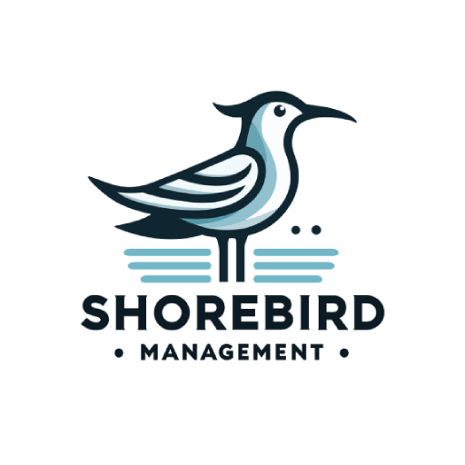

# Shorebird Landing Page

A modern, high-converting B2B SaaS landing page for **Shorebird Management** — a done-for-you business management operating system for contractors, trades, and service businesses.



## 🚀 Overview

This landing page serves as the marketing front-door for Shorebird Management, driving prospects to book discovery calls. Built with a focus on:

- **Authority & Trust** — Premium design that establishes credibility
- **Value Communication** — Clear messaging about the comprehensive solution
- **Conversion Optimization** — Strategic CTAs throughout the page
- **Client Access** — Workspace lookup for existing customers

### Target Audience

- **Contractors** — General contractors, subcontractors, construction
- **Trades** — HVAC, plumbing, electrical, roofing
- **Landscaping** — Lawn care, hardscaping, tree services
- **Service Businesses** — Cleaning, pest control, property maintenance
- **And more** — Any service business juggling jobs, customers, and crews

## ✨ Features

### Design
- 🎨 Modern AI/automation aesthetic inspired by claude.ai, n8n.io, and linear.app
- 🌓 Dark/Light mode with system preference detection
- 📱 Fully responsive design (mobile-first)
- ✨ Glass morphism cards and gradient effects
- 🎭 Smooth scroll-triggered animations with Framer Motion

### Sections
1. **Hero** — Animated gradient background with compelling headline
2. **Pain Points** — Resonates with contractor/business frustrations
3. **Solution Overview** — Hub diagram showing unified platform
4. **Features Grid** — 8 key capabilities with icons
5. **How It Works** — 5-step implementation timeline
6. **Results/ROI** — Quantified benefits
7. **Org Lookup** — Supabase-powered workspace search for clients
8. **FAQ** — Animated accordion with common questions
9. **Final CTA** — Calendly embed for booking
10. **Footer** — Links and social

### Integrations
- **Calendly** — Popup and inline booking widgets
- **Supabase** — Organization lookup for existing clients
- **Google Fonts** — Plus Jakarta Sans, Inter, JetBrains Mono

## 🛠 Tech Stack

| Technology | Purpose |
|------------|---------|
| [Vite](https://vitejs.dev/) | Build tool & dev server |
| [React 18](https://react.dev/) | UI framework |
| [TypeScript](https://www.typescriptlang.org/) | Type safety |
| [Tailwind CSS](https://tailwindcss.com/) | Utility-first styling |
| [Framer Motion](https://www.framer.com/motion/) | Animations |
| [Lucide React](https://lucide.dev/) | Icons |
| [Supabase](https://supabase.com/) | Database & auth |

## 📦 Installation

```bash
# Clone the repository
git clone https://github.com/your-org/shorebird-landing.git
cd shorebird-landing

# Install dependencies
npm install

# Start development server
npm run dev
```

## ⚙️ Configuration

Create a `.env` file in the root directory:

```env
# Supabase (for org lookup)
VITE_SUPABASE_URL=https://your-project.supabase.co
VITE_SUPABASE_ANON_KEY=your-anon-key

# Domain configuration
VITE_BASE_DOMAIN=shorebird.io

# Calendly booking URL
VITE_CALENDLY_URL=https://calendly.com/shorebird/discovery
```

## 🏗 Project Structure

```
src/
├── components/
│   ├── ui/                 # Reusable UI components
│   │   ├── Button.tsx      # CTA buttons with glow effects
│   │   ├── GlassCard.tsx   # Glass morphism cards
│   │   ├── Input.tsx       # Form inputs
│   │   └── Section.tsx     # Section wrapper
│   ├── Hero.tsx            # Hero section
│   ├── PainPoints.tsx      # Problem section
│   ├── Solution.tsx        # Solution hub diagram
│   ├── Features.tsx        # Features grid
│   ├── HowItWorks.tsx      # Timeline section
│   ├── Results.tsx         # ROI section
│   ├── OrgLookup.tsx       # Client workspace search
│   ├── FAQ.tsx             # FAQ accordion
│   ├── FinalCTA.tsx        # Calendly embed
│   ├── Footer.tsx          # Footer
│   ├── Navbar.tsx          # Navigation
│   └── ThemeToggle.tsx     # Theme switcher
├── hooks/
│   ├── useTheme.ts         # Theme state management
│   └── useScrollReveal.ts  # Scroll animation hook
├── lib/
│   └── supabase.ts         # Supabase client
├── App.tsx                 # Main app
├── index.css               # Global styles
└── main.tsx                # Entry point
```

## 🎨 Design System

### Colors

The primary brand color is **Shorebird Teal** (`#72b7c7`):

```css
--primary-400: #72b7c7;  /* Main brand color */
--primary-500: #5a9fad;  /* Hover state */
--primary-600: #4a8594;  /* Active state */
```

### Typography

- **Headings**: Plus Jakarta Sans (700, 800)
- **Body**: Inter (400, 500, 600)
- **Monospace**: JetBrains Mono (400, 500)

### Effects

- Glass morphism with `backdrop-blur`
- Gradient mesh backgrounds
- Animated floating orbs
- Glow effects on CTAs

## 📜 Available Scripts

```bash
# Development
npm run dev          # Start dev server at http://localhost:5173

# Production
npm run build        # Build for production
npm run preview      # Preview production build

# Code Quality
npm run lint         # Run ESLint
```

## 🚀 Deployment

### Cloudflare Pages

1. Connect your repository to Cloudflare Pages
2. Configure build settings:
   - **Build command**: `npm run build`
   - **Build output directory**: `dist`
3. Add environment variables in the dashboard
4. Configure custom domains:
   - `shorebird.io`
   - `www.shorebird.io`

### Manual Deployment

```bash
# Build the project
npm run build

# The dist/ folder contains the static files
# Deploy to any static hosting provider
```

## 🔧 Customization

### Adding New Sections

1. Create component in `src/components/`
2. Import in `src/App.tsx`
3. Add to the main layout

### Modifying Theme

Edit `tailwind.config.js` to customize:
- Colors (`theme.extend.colors`)
- Fonts (`theme.extend.fontFamily`)
- Animations (`theme.extend.animation`)

### Updating Content

All content is contained within individual components. Edit the relevant component file to update copy, images, or structure.

## 📋 Browser Support

- Chrome (latest)
- Firefox (latest)
- Safari (latest)
- Edge (latest)

## 📄 License

Proprietary - © 2025 Shorebird Management. All rights reserved.

## 🤝 Support

For questions or support, contact [hello@shorebirdmanagement.com](mailto:hello@shorebirdmanagement.com)

---

Built with ❤️ for contractors, trades, and service businesses
